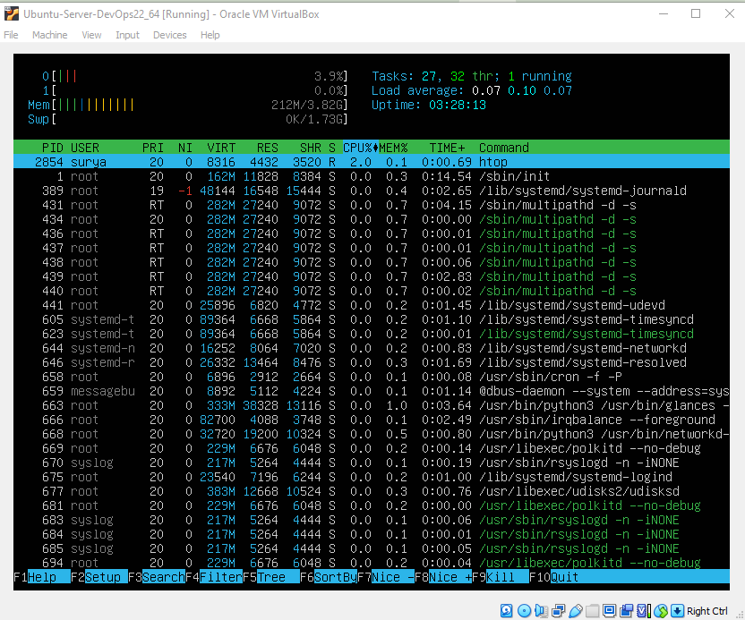

Lab = Simulasi praktikum atau latihan langsung (biasanya berbentuk panduan interaktif atau sandbox belajar)  
# 1 Your First Linux Lab

- [x] 1. Hello World 
- [ ] 2. Displaying User and Group Information
- [ ] 3. Learn By Doing
- [ ] 4. Displaying the Current User
- [x] 5. htop System Monitor

Latihan ini ada di daftar perintah terminal di https://github.com/corotdesain/mybelajar-linux/blob/master/modules/01-cli.md
Hello World di terminal
```bash
## Menampilkan Informasi Pengguna dan Grup
id
uid=5000(labex) gid=5000(labex) groups=5000(labex),27(sudo),121(ssl-cert),5002(public)
```
uid: Your User ID (a unique numerical identifier).  
gid: Your primary Group ID.  
groups: All the groups you are a member of.  
sudo singkatan dari:
“superuser do”
Yang artinya: 👉 Jalankan perintah sebagai superuser (admin/root)

```bash
## Kita juga bisa mengubah id pengguna untuk melihat pengguna lain yang ada (yang aktif/yang login)
id root
```
Selain melihat info user kamu sendiri, kamu bisa pakai id <nama_user> untuk melihat info user lain, seperti  
`id root`, `id ubuntu`, `id user123`, dll.


```
echo "Hello LabEx"

```
5 'htop' System Monitor  
Pertama Instal dulu pada linux aplikasi yang bermanfaat bernama `htop`, seperti *apps store* di smart phone, linux punya __Package managers__ yang memudahkan pencarinan aplikasi dan pemasangan.  

sebelum melakukan instal aplikasi pastikan ubuntu kita terupdate dengan cara `sudo apt update` 
kemudian lakukan instalasi `htop`  
dengan mengetik `sudo apt install htop`  
ket:  
`sudo`: Singkatan dari "SuperUser DO." Memungkinkan Anda untuk menjalankan perintah dengan hak istimewa administrator (untuk sementara).  
`apt`: Alat untuk menginstal dan mengelola perangkat lunak.  
`install`: Memberitahu apt bahwa kita ingin menginstal sebuah program.  
`htop`: Program spesifik yang ingin kita instal.  

  Maka akan muncul tampilan __aplikasi htop pada ubuntu__  
  

htop menampilkan:

Bagian Atas: penggunaan CPU dan memory, as well as how long your computer has been running (uptime).  
Tengah : List dari semua program yang berjalan (processes).  
Bawah: Opsi untuk interaksi dengan htop.  

Cara terbaik untuk memahami htop adalah dengan bereksperimen dengan aplikasi `hatop` ini! Jelajahi fitur-fiturnya dan lihat apa yang dapat di temukan.  
