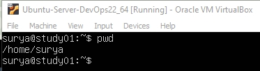
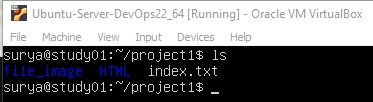
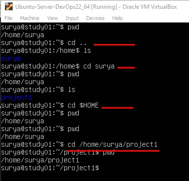
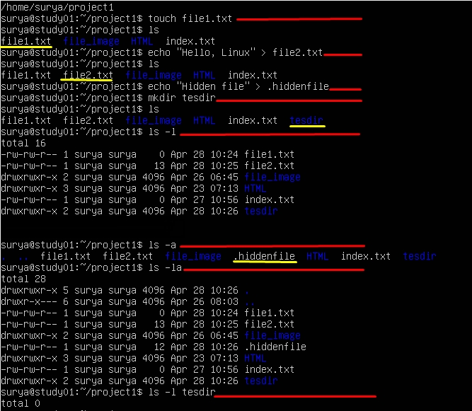
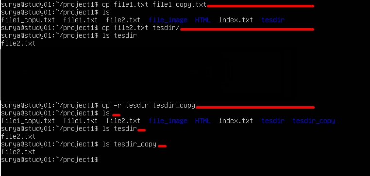
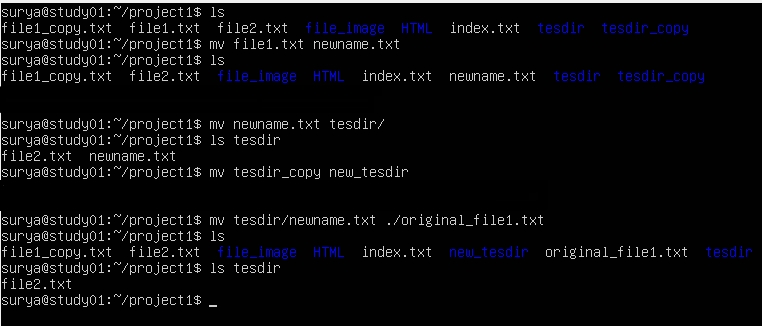
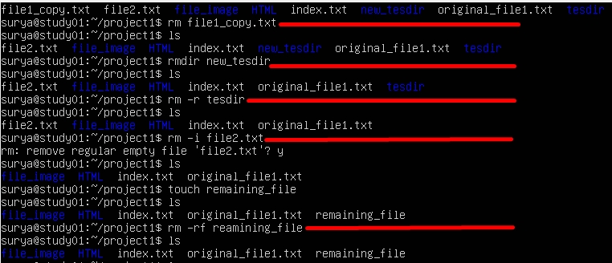

# 2 Basic Files Operations

- [x] 2.1. *Understanding Your Working Environment* (Memahami Lingkungan Kerja Anda) 
- [x] 2.2. *Navigating the File System* (Menavigasi Sistem File)  
- [x] 2.3. *Creating Files and Listing Directory Contents* (Membuat File dan Mencantumkan Isi Direktori)  
- [x] 2.4. *Copying Files and Directories* (Menyalin File dan Direktori)  
- [x] 2.5. *Moving and Renaming Files and Directories* (Memindahkan dan Mengganti Nama File dan Direktori)
- [x] 2.6. *Removing Files and Directories* (Menghapus File dan Direktori)

- [x] 2.1 *Understanding Your Working Environment* (Memahami Lingkungan Kerja Anda)        
     - [x]   `echo ~` sama dengan `echo $HOME` untuk menunjukkan lokasi home yang digunakan. fungsinya jika ada di atas direktori, akan terasa bermanfaat. 
             Di Linux, setiap pengguna biasanya memiliki "direktori `home`," yang dilambangkan dengan `~` disebut (tilda).  
     - [x]   `pwd` adalah singkatan dari "print working directory". __Perintah ini menampilkan lokasi Anda saat ini__ dalam sistem berkas.
              Perintah ini penting untuk mengenal struktur berkas Linux.  
                  
              
              Memahami perbedaan antara direktori kerja saat ini dan direktori home penting  
              untuk menavigasi sistem berkas Linux secara efektif.
             

     - [x]     `ls` atau list untuk menampilkan yang ada pada direktori.  
                
                pada direktori ini terdapat 2 folder dan 1 file.  
                folder file_image  
                folder HTML  
                file index.txt  
     - [x]     perintah `ls ~` sama dengan `ls $HOME`  
           

        
      
- [x] 2.2. *Navigating the File System* (Menavigasi Sistem File)
     - [x]     navigation to parent directory
               `cd ..` (change direktory) untuk ke *Parent directory* pada urutan folder kembali ke folder sebelumnya.  
     - [x]     Navigation back to project directory   
               kembali ke project semula `cd  /surya/project1`  
     - [x]     Navigation to home directory
               `cd $HOME` atau `cd ~`untuk shortcut kembali ke home.
     - [x]     Absolute path navigation
                `cd /home/surya/project1`          
               
      
- [x] 2.3. *Creating Files and Listing Directory Contents* (Membuat File dan Mencantumkan Isi Direktori)  
                
      Pada latihan disini ada 8 perintah (garis merah).

     - [x] 1   `touch` command usage / perintah `touch`membuat file
               perintah : `touch file1.txt`  
     - [x] 2   `echo` command usage for file creation / perintah `echo` membuat file
          - [x] `echo "Hello, Linux" > file2.txt`  
              >  penjelasan:  
              > `echo` is a command that prints text.    
              > The `>` symbol redirects the output of `echo` into a file named `file2.txt`.  
              > If the file doesn't exist, it's created. If it does exist, its content is replaced.  
          - [x] `echo "Hidden file" > .hiddenfile`    
              >  penjelasan: 
                This creates a hidden file. In Linux, any file or directory name that starts with a dot (.) is considered hidden.  
     - [x] 3.   let's create a directory `mkdir` directory creation  
                `mkdir testdir` 
     - [x] 4.    Basic listing:  
                `ls`
     - [x] 5.    Detailed listing:  
                `ls -l`    
     - [x] 6.    Show hidden files:  
                `ls -a` `ls -la`  listing specific directory
     - [x] 7.    Combine options:
                `ls -la`
     - [x] 8.    List contents of a specific directory:  
                `ls -l testdir`  
               pada gambar lokasi kerja ada di `/home/surya/project1`    
               namun untuk melihat isi dalam folder `tesdir` dapat langsung menambahkan perintah folder tujuan.

- [x] 2.4. *Copying Files and Directories* (Menyalin File dan Direktori)    
              

     - [x] 1 Copy a file:  
            `cp file1.txt file1_copy.txt`  
             Ket: This creates a copy of file1.txt named file1_copy.txt in the current directory.
            `ls` untuk konformasi pengecekan  
     - [x] 2 Copy a file to another directory:  
            `cp file2.txt testdir/  
            Ket: This copies file2.txt into the testdir directory.`
     - [x] 3 Copy a directory:  
            `cp -r testdir testdir_copy`  
            Ket: The -r option stands for "recursive". It's necessary when copying directories to ensure all contents are copied
     - [x] 4 Verify our copies:  
            `ls`  
            `ls testdir`  
            `ls testdir_copy`  

- [x] 2.5. *Moving and Renaming Files and Directories* (Memindahkan dan Mengganti Nama File dan Direktori)
            
     - [x]  1 Rename a file:
            `mv file1.txt newname.txt`  
              >  This renames file1.txt to newname.txt.     
     - [x]  2 Move a file to a directory:
            `mv newname.txt testdir/`  
            This moves newname.txt into the testdir directory.  
     
     - [x]  3 Rename a directory:
            `mv testdir_copy new_testdir`  
            This renames testdir_copy to new_testdir.     
     - [x]  4 Move and rename in one command:
            `mv testdir/newname.txt ./original_file1.txt`  
            This moves newname.txt out of testdir and renames it to original_file1.txt in the current directory.  
 
     - [x]   5 Verify our changes:  
            `ls`  
            `ls testdir`  
- [x] 2.6. *Removing Files and Directories* (Menghapus File dan Direktori)
            
     - [x]    1 Remove a file:  
               `rm file1_copy.txt`  
                This permanently deletes file1_copy.txt.  
     - [x]    2 Remove an empty directory:  
                `rmdir new_testdir`  
                `rmdir` only works on empty directories, and you'll get an error if the directory isn't empty.  
     
     - [x]    3 Remove a directory and its contents:  
                `rm -r testdir`  
                The -r option is needed to remove directories and their contents recursively.  
 
     - [x]    4 Remove files interactively:  
                `rm -i file2.txt`  
                The -i option prompts for confirmation before each removal. Type 'y' and press Enter to confirm deletion.  
     
     - [x]    5 Force removal without prompts:  
                `touch remaining_files`  
                `ls`  
                `rm -rf remaining_files`  
                The -rf combination is very powerful and potentially dangerous. It means:  
                -r: recursive (for directories)  
                -f: force (ignore nonexistent files, never prompt)  
> CAUTION: rm -rf will delete files and directories without asking for confirmation. It can be extremely destructive if used incorrectly. Always double-check your command before using it, especially when using it with wildcards or as a superuser.  
  - [ ]    6 Verify our removals:
`ls`
Remember: In Linux, there's usually no "Recycle Bin" or "Trash" for the command line. When you delete something with rm, it's generally gone for good.

