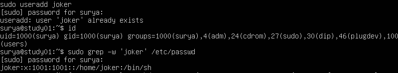
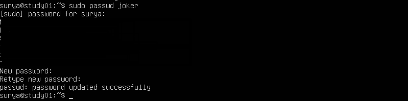
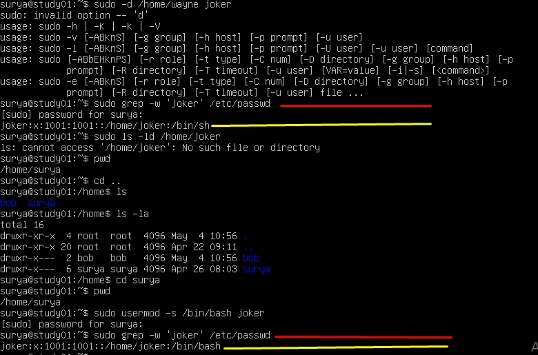

# 5 File Contents and Comparing (Isi File dan perbandingannya)

- [x] 1. Creating a New User  
- [x] 2. Creating a User with a Home Directory  
- [x] 3. Setting a User Password  
- [x] 4. Modifying User Properties  
- [x] 5. Changing User Shell  
- [ ] 6. Adding a User to a Group  
- [ ] 7. Locking and Unlocking User Accounts 
- [ ] 8. Deleting a User  


 Pada praktikum kali ini akan di pandu untuk mempelajari 'dasar manajemen akun pengguna' di sistem lilux. Anda akan belajar membuat, mengubah dan menghapus user akun, serta mengatur dan mengubah katasandi. Ini adalah ketrampilan dasar untuk sistem administrasi linux.
 
 
 - [x] 1. Creating a New User (membuat user baru)

Let's start by creating a new user account named "joker".  membuat user dengan nama "joker"
```
sudo useradd joker
```  

Let's break this down:  

- `sudo` is a command that gives you temporary superuser (administrator) privileges. We use it because creating a new user requires these higher-level permissions.  
- `useradd` is the command to create a new user. (`useradd` merupakan perintah untuk membuat satu pengguna baru)  
- `joker` is the username we're creating. (`joker` merupakan username yang kita buat)  
- Note: If you try to run this command without `sudo`, you'll get a "permission denied" error. This is because regular users aren't allowed to create new user accounts - it's a task reserved for system administrators.  
Catatan: jika kamu mencoba menjalankan tanpa `sudo`, kamu akan menerima pesan error "permission denied". Hal ini karena user biasa tidak diizinkan untuk membuat akun pengguna baru - ini merupakan tugas untuk administrator sistem.  

This highlights the difference between a superuser and a common user. As a common user(sebagai pengguna biasa), you can't create new user accounts (kamu tidak dapat membuat akun user baru), but by using sudo (tapi dengan menggunakan `sudo`), you can temporarily elevate your privileges to perform this administrative task. (untuk sementara kamu dapat menjalankan hak istimewa untuk menjalankan tugas administrator)  

     
This line shows:

Username: joker  
Password: x (the actual password is stored securely elsewhere)  
User ID: 1001  
Group ID: 1001  
Home Directory: /home/joker, but it hasn't been created yet  
Default Shell: /bin/sh  

 - [x] 2. Creating a User with a Home Directory (membuat satu user dengan direktori beranda)  
*Now, let's create another user named "bob" and give them a home directory.*  
Sekarang, Ayo kita membuat user dengan nama "bob" dan beri sebuah direktori beranda.  
```
sudo useradd -m bob
```
*The `-m` option tells the system to create a home directory for the user. A home directory is like a personal folder where a user can store their files and settings.*  
Opsi `-m` memberitau sistem untuk membuat sebuah direktori beranda untuk pengguna. Sebuah direktori home seperti folder pribadi user untuk menyimpan file dan pengaturannya.  

Next verify that the home directory was created:
Selanjutnya memverifikasi bahwa direktori home telah terbuat:
```
sudo ls -ld /home/bob
```  
This output shows:  
Akan menampilkan  
 
`d` at the start means it's a directory  
`rwxr-x---` shows who can read, write, or execute in this directory (menunjukkan siapa yang dapat membaca menulis, atau mengeksekusi di direktory ini)  
The two `bob` entries show that both the user and group owner of this directory is bob  
`4096` is the size of the directory in bytes  
`May 4 10:56` is when the directory was created (adalah dimana direktoei dibuat)  
`/home/bob` is the location of the directory   
  
 - [x] 3. Setting a User Password (mengatur password sebuah user)
    - Run the following command: (Sekarang jalankan perintah berikut:)
      ```
      sudo passwd joker
      ```
    -   
    You'll be asked to enter a new password twice. For this lab, use a simple password like "password123".
The password will not be displayed as you type it. This is a security feature to prevent others from seeing your password as you type it.  

Important: Remember this password! You'll need it later in the lab.  

If successful, you'll see a message saying "passwd: password updated successfully".  
Note: In a real-world scenario, always use strong, unique passwords!  

Behind the scenes (dibelakang layar),  Linux stores encrypted passwords in a secure file called (linux menyimpan password terenkripsi dalam file aman bernama) `/etc/shadow`. This is more secure than storing them in the (ini lebih aman daripada menyimpannya dalam ) `/etc/passwd` file where anyone could see them (file dimana siapapun dapat melihatnya).

 - [x] 4. Modifying User Properties (memodifikasi propertis user)
        Linux memungkinkan kita mengubah berbagai pengaturan untuk akun user setelah di buat. Mari kita ubah direktori home joker sebagai contoh.
       ```
       sudo usermod -d /home/wayne joker ```  
       Here's what this does: (ini penjelasan perintah tersebut:)

`usermod` is the command to modify user account settings (perintah untuk memodifikasi akun user)  
`-d /home/wayne` specifies the new home directory (spesifik home directori baru)
`joker` is the user we're modifying (dimana user yang dimodifikasi)
        Verifikasi perubahannya
        ``` 
        sudo grep -w 'joker' /etc/passwd ```  
        `-w` is used to match the whole word (-w digunakan untuk mencocokkan keseluruhan kata), and `grep` is used to search for the word in the file (digunakan untuk mencari kata dalam file). You should see that joker's home directory has been updated in the output (anda akan melihat direktori home joker telah di perbarui di output).
    
  - [x] 5 Changing User Shell (mengubah
        *Another important setting we can modify is the user's default shell. The shell is the program that interprets and runs the commands you type in the terminal.*  
        Pengaturan penting lainnya yang dapat kita ubah adalah shell default milik pengguna. Shell adalah program yang menginterpretasikan dan menjalankan perintah yang Anda ketik di terminal.  
          
*By default, the user 'joker' is using /bin/sh as their shell. While sh (Bourne Shell) is a basic shell that's present on most Unix-like systems, bash (Bourne Again Shell) offers more features and is generally more user-friendly.*  
Secara default, pengguna 'joker' menggunakan /bin/sh sebagai shell mereka. Sementara sh (Bourne Shell) merupakan shell dasar yang ada di sebagian besar sistem mirip Unix, bash (Bourne Again Shell) menawarkan lebih banyak fitur dan umumnya lebih mudah digunakan.  

*Changing joker's shell to bash provides several benefits:*  
Mengubah shell joker menjadi bash memberikan beberapa manfaat:  
        - *More intuitive command-line interface*  
          Antarmuka baris perintah yang lebih intuitif  
        - *Enhanced scripting capabilities*  
          Kemampuan skrip yang ditingkatkan    
        - *Better customization options for the user's environment*  
          Pilihan penyesuaian yang lebih baik untuk lingkungan pengguna  
          
        ```
        sudo usermod -s /bin/bash joker
        ```  
   Verifikasi perubahan  
       ``` sudo grep -w 'joker' /etc/passwd```  

   


You should see `/bin/bash` at the end of joker's entry. This means bash is now joker's default shell.  

After making this change, joker will have access to the more feature-rich bash environment whenever they log in or open a new terminal session.  

  - [ ] 6. Adding a User to a Group

  - [ ] 7. Locking and Unlocking User Accounts
  - [ ] 8. Deleting a User (menghapus user)       
  - [ ]   Summary
Congratulations! You've completed the Linux User Account Management lab. You've learned how to:

Create new user accounts
Set user passwords
Modify user properties like home directory and default shell
Add users to groups
Lock and unlock user accounts
Delete user accounts
You've also been introduced to important Linux concepts like the /etc/passwd file, home directories, shells, and user groups. These are fundamental skills for Linux system administration. Remember, in real-world scenarios, always follow your organization's security policies when managing user accounts
