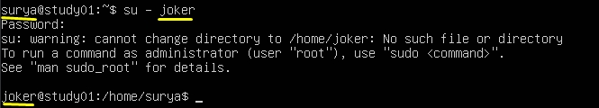
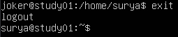
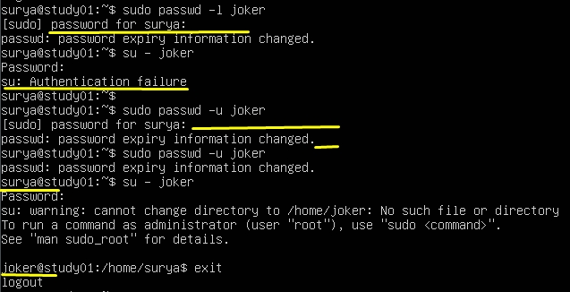

# 5 File Contents and Comparing (Isi File dan perbandingannya)

- [x] 1. Creating a New User  
- [x] 2. Creating a User with a Home Directory  
- [x] 3. Setting a User Password  
- [x] 4. Modifying User Properties  
- [x] 5. Changing User Shell  
- [x] 6. Adding a User to a Group  
- [x] 7. Locking and Unlocking User Accounts 
- [X] 8. Deleting a User  


 Pada praktikum kali ini akan di pandu untuk mempelajari 'dasar manajemen akun pengguna' di sistem lilux. Anda akan belajar membuat, mengubah dan menghapus user akun, serta mengatur dan mengubah katasandi. Ini adalah ketrampilan dasar untuk sistem administrasi linux.
 
 
 - [x] 1. Creating a New User (membuat user baru)

Let's start by creating a new user account named "joker".  membuat user dengan nama "joker"
```
sudo useradd joker
```  

Let's break this down:  

- `sudo` is a command that gives you temporary superuser (administrator) privileges. We use it because creating a new user requires these higher-level permissions.  
- `useradd` is the command to create a new user. (`useradd` merupakan perintah untuk membuat satu pengguna baru)  
- `joker` is the username we're creating. (`joker` merupakan username yang kita buat)  
- Note: If you try to run this command without `sudo`, you'll get a "permission denied" error. This is because regular users aren't allowed to create new user accounts - it's a task reserved for system administrators.  
Catatan: jika kamu mencoba menjalankan tanpa `sudo`, kamu akan menerima pesan error "permission denied". Hal ini karena user biasa tidak diizinkan untuk membuat akun pengguna baru - ini merupakan tugas untuk administrator sistem.  

This highlights the difference between a superuser and a common user. As a common user(sebagai pengguna biasa), you can't create new user accounts (kamu tidak dapat membuat akun user baru), but by using sudo (tapi dengan menggunakan `sudo`), you can temporarily elevate your privileges to perform this administrative task. (untuk sementara kamu dapat menjalankan hak istimewa untuk menjalankan tugas administrator)  

     
This line shows:

Username: joker  
Password: x (the actual password is stored securely elsewhere)  
User ID: 1001  
Group ID: 1001  
Home Directory: /home/joker, but it hasn't been created yet  
Default Shell: /bin/sh  

 - [x] 2. Creating a User with a Home Directory (membuat satu user dengan direktori beranda)  
*Now, let's create another user named "bob" and give them a home directory.*  
Sekarang, Ayo kita membuat user dengan nama "bob" dan beri sebuah direktori beranda.  
```
sudo useradd -m bob
```
*The `-m` option tells the system to create a home directory for the user. A home directory is like a personal folder where a user can store their files and settings.*  
Opsi `-m` memberitau sistem untuk membuat sebuah direktori beranda untuk pengguna. Sebuah direktori home seperti folder pribadi user untuk menyimpan file dan pengaturannya.  

Next verify that the home directory was created:
Selanjutnya memverifikasi bahwa direktori home telah terbuat:
```
sudo ls -ld /home/bob
```  
This output shows:  
Akan menampilkan  
 
`d` at the start means it's a directory  
`rwxr-x---` shows who can read, write, or execute in this directory (menunjukkan siapa yang dapat membaca menulis, atau mengeksekusi di direktory ini)  
The two `bob` entries show that both the user and group owner of this directory is bob  
`4096` is the size of the directory in bytes  
`May 4 10:56` is when the directory was created (adalah dimana direktoei dibuat)  
`/home/bob` is the location of the directory   
  
 - [x] 3. Setting a User Password (mengatur password sebuah user)
    - Run the following command: (Sekarang jalankan perintah berikut:)
      ```
      sudo passwd joker
      ```
    -   
    You'll be asked to enter a new password twice. For this lab, use a simple password like "password123".
The password will not be displayed as you type it. This is a security feature to prevent others from seeing your password as you type it.  

Important: Remember this password! You'll need it later in the lab.  

If successful, you'll see a message saying "passwd: password updated successfully".  
Note: In a real-world scenario, always use strong, unique passwords!  

Behind the scenes (dibelakang layar),  Linux stores encrypted passwords in a secure file called (linux menyimpan password terenkripsi dalam file aman bernama) `/etc/shadow`. This is more secure than storing them in the (ini lebih aman daripada menyimpannya dalam ) `/etc/passwd` file where anyone could see them (file dimana siapapun dapat melihatnya).

 - [x] 4. Modifying User Properties (memodifikasi propertis user)
        Linux memungkinkan kita mengubah berbagai pengaturan untuk akun user setelah di buat. Mari kita ubah direktori home joker sebagai contoh.
       ```
       sudo usermod -d /home/wayne joker ```  
       Here's what this does: (ini penjelasan perintah tersebut:)

`usermod` is the command to modify user account settings (perintah untuk memodifikasi akun user)  
`-d /home/wayne` specifies the new home directory (spesifik home directori baru)
`joker` is the user we're modifying (dimana user yang dimodifikasi)
        Verifikasi perubahannya
        ``` 
        sudo grep -w 'joker' /etc/passwd ```  
        `-w` is used to match the whole word (-w digunakan untuk mencocokkan keseluruhan kata), and `grep` is used to search for the word in the file (digunakan untuk mencari kata dalam file). You should see that joker's home directory has been updated in the output (anda akan melihat direktori home joker telah di perbarui di output).
    
  - [x] 5 Changing User Shell (mengubah
        *Another important setting we can modify is the user's default shell. The shell is the program that interprets and runs the commands you type in the terminal.*  
        Pengaturan penting lainnya yang dapat kita ubah adalah shell default milik pengguna. Shell adalah program yang menginterpretasikan dan menjalankan perintah yang Anda ketik di terminal.  
          
*By default, the user 'joker' is using /bin/sh as their shell. While sh (Bourne Shell) is a basic shell that's present on most Unix-like systems, bash (Bourne Again Shell) offers more features and is generally more user-friendly.*  
Secara default, pengguna 'joker' menggunakan /bin/sh sebagai shell mereka. Sementara sh (Bourne Shell) merupakan shell dasar yang ada di sebagian besar sistem mirip Unix, bash (Bourne Again Shell) menawarkan lebih banyak fitur dan umumnya lebih mudah digunakan.  

*Changing joker's shell to bash provides several benefits:*  
Mengubah shell joker menjadi bash memberikan beberapa manfaat:  
        - *More intuitive command-line interface*  
          Antarmuka baris perintah yang lebih intuitif  
        - *Enhanced scripting capabilities*  
          Kemampuan skrip yang ditingkatkan    
        - *Better customization options for the user's environment*  
          Pilihan penyesuaian yang lebih baik untuk lingkungan pengguna  
          
        ```
        sudo usermod -s /bin/bash joker
        ```  
   Verifikasi perubahan  
       ``` sudo grep -w 'joker' /etc/passwd```  

   


*You should see `/bin/bash` at the end of joker's entry. This means bash is now joker's default shell.*  
Anda akan melihat /bin/bash di akhir entri joker. Ini berarti bash sekarang menjadi shell default joker.  
  
*After making this change, joker will have access to the more feature-rich bash environment whenever they log in or open a new terminal session.*    
Setelah melakukan perubahan ini, joker akan memiliki akses ke lingkungan bash yang lebih kaya fitur setiap kali mereka masuk atau membuka sesi terminal baru.

  - [x] 6. Adding a User to a Group  (menambahkan pengguna ke grup)
            *In Linux, we use groups to organize users and manage permissions. One important group is the `sudo` group, which gives users administrative privileges. Let's add joker to the `sudo` group as an example.*
            Di Linux, kita menggunakan grup untuk mengatur pengguna dan mengelola izin. Salah satu grup yang penting adalah grup `sudo`, yang memberikan hak istimewa administratif kepada pengguna. Mari kita tambahkan joker ke grup `sudo` sebagai contoh.  
        *Why would we add a user to the sudo group?*  
        Mengapa kita perlu menambahkan pengguna ke grup sudo?  
        - *System administration: Users in the sudo group can perform system-wide administrative tasks.*  
          Administrasi sistem: Pengguna dalam grup sudo dapat melakukan tugas administratif di seluruh sistem.  
        - *Software installation: Sudo group members can install and update software packages.*  
          Instalasi perangkat lunak: Anggota grup sudo dapat menginstal dan memperbarui paket perangkat lunak.  
        - *Configuration changes: They can modify system configuration files.*  
          Perubahan konfigurasi: Mereka dapat mengubah berkas konfigurasi sistem.  
        - *User management: They can create, modify, or delete other user accounts.*
          Manajemen pengguna: Mereka dapat membuat, mengubah, atau menghapus akun pengguna lain.  
        ----------------------  
        ----------------------  
        *You might wonder: "Why add someone to the sudo group when we can always use the 'sudo' command?" Here's why:*  
        Anda mungkin bertanya tanya: "Mengapa menambahkan seseorang ke grup sudo jika kita selalu dapat menggunakan perintah 'sudo'?" Berikut alasannya:
        - *Convenience: Users in the sudo group can use sudo without needing to know the root password. They use their own password instead.*        
        Kenyamanan: Pengguna dalam grup sudo dapat menggunakan sudo tanpa perlu mengetahui kata sandi root. Mereka menggunakan kata sandi mereka sendiri.  
        - *Granular control: System administrators can configure sudo to allow specific users to run only certain commands with superuser privileges.*  
        Kontrol terperinci: Administrator sistem dapat mengonfigurasi sudo untuk mengizinkan pengguna tertentu menjalankan perintah tertentu saja dengan hak istimewa superuser.  
        - *Accountability: Unlike sharing the root password, sudo logs who ran what command, improving security and traceability.*
        Akuntabilitas: Tidak seperti berbagi kata sandi root, sudo mencatat siapa yang menjalankan perintah apa, sehingga meningkatkan keamanan dan keterlacakan.  
        - *Security: It's generally more secure to have named accounts with sudo access than to share the root password among multiple admins.*
        Keamanan: Secara umum lebih aman untuk memiliki akun bernama dengan akses sudo daripada berbagi kata sandi root di antara beberapa admin.
          
    *In a real-world scenario, you would typically add a user to the sudo group if:*
    Dalam skenario dunia nyata, Anda biasanya akan menambahkan pengguna ke grup sudo jika:  

    - *They are a system administrator or IT staff member who needs to perform regular maintenance tasks.  
       Mereka adalah administrator sistem atau anggota staf TI yang perlu melakukan tugas pemeliharaan rutin.  
    - *They are a developer who needs to install specific software or make system changes for their work.  
        Mereka adalah pengembang yang perlu memasang perangkat lunak tertentu atau membuat perubahan sistem untuk pekerjaan mereka.  
    - *They are a power user who needs elevated privileges for certain tasks, but you don't want to give them the root password.
      Mereka adalah pengguna ahli yang memerlukan hak istimewa lebih tinggi untuk tugas tertentu, tetapi Anda tidak ingin memberi mereka kata sandi root.

  >>  Remember, adding a user to the `sudo` group gives them significant power over the system, so this should be done cautiously and only when necessary.  
  >>  Ingat, menambahkan pengguna ke grup `sudo` memberi mereka kekuasaan yang signifikan atas sistem, jadi ini harus dilakukan dengan hati-hati dan hanya jika diperlukan.   
   -  Now, let's add joker to the sudo group:  
      Sekarang, mari tambahkan joker ke grup sudo:  
       ```
       sudo usermod -aG sudo joker
       ```  
      Keterangan nya   
      Here's what this does:  
    `usermod` is the command to modify user accounts  
    `-aG` means "append to Group" (add to a group without removing from other groups)  
    `sudo` is the group we're adding the user to  
    `joker` is the user we're modifying  
  
   -  *Verify the change:*
       memferifikasi perubahannya:
       ```
       groups joker
       ```
       Anda seharusnya melihat `sudo` tercantum di antara grup `joker`.
        
   -  *To see the effect of this change, we need to switch to the joker user and try a command that requires sudo privileges:*
      Untuk melihat efek perubahan ini, kita perlu beralih ke pengguna joker dan mencoba perintah yang memerlukan hak istimewa sudo:  
       ```
       su - joker
       ```
         
       *This command switches from your current user (`surya`) to the `joker` user. You will be prompted to enter joker's password. Remember, this is the password you set earlier (password123). As you type the password, you won't see any characters on the screen - this is a security feature.*  
       Perintah ini akan mengubah pengguna Anda saat ini (`surya`) menjadi pengguna `joker`. Anda akan diminta memasukkan kata sandi joker. Ingat, ini adalah kata sandi yang Anda tetapkan sebelumnya (password123). Saat Anda mengetik kata sandi, Anda tidak akan melihat karakter apa pun di layar - ini adalah fitur keamanan.
   -  *Once logged in as joker, let's try to view a file that normally requires root privileges:*
       Setelah masuk sebagai joker, mari kita coba melihat file yang biasanya memerlukan hak akses root:
      
      ```
      sudo cat /etc/shadow
      ```
      Enter joker's password again when prompted. You should be able to see the contents of the /etc/shadow file, which is usually only accessible to root. This confirms that joker now has sudo privileges.  
      Masukkan kembali kata sandi joker saat diminta. Anda seharusnya dapat melihat isi berkas /etc/shadow, yang biasanya hanya dapat diakses oleh root. Ini mengonfirmasi bahwa joker sekarang memiliki hak akses sudo.  
        
   -  *After you're done, type exit to return to your original user account (labex).*  
      Setelah selesai, ketik exit untuk kembali ke akun pengguna asli Anda (labex).  
         
Note: In a production environment, you should be very careful about who you add to the sudo group. With great power comes great responsibility!  
Catatan: Dalam lingkungan produksi, Anda harus sangat berhati-hati tentang siapa yang Anda tambahkan ke grup sudo. Dengan kekuatan besar datanglah tanggung jawab besar!  
        
  - [x] 7. Locking and Unlocking User Accounts.
        Sometimes, you might need to temporarily disable a user account without deleting it.
   -  *Lock the joker account:* mengunci akun `joker`  
    ``` sudo passwd -l joker```
    *The `-l` option locks the password.*  opsi `-l` mengunci password.  
    __`-l` untuk Lock__  
    *You'll be asked for a password. Enter the password you set for joker earlier ("password123" if you followed our suggestion).*  
    Anda akan dimintai kata sandi. Masukkan kata sandi yang Anda tetapkan untuk joker sebelumnya ("password123" jika Anda mengikuti saran kami).  
    *You should see an "authentication failure" message. This means the account is successfully locked.*  
    Anda akan melihat pesan "authentication failure". Ini berarti akun berhasil dikunci.  
        
   -  *unlock the account:* membuka kunci akun:  
        ```sudo passwd -u joker```  
      The -u option unlocks the password.  
   -  Coba ke akun `joker` lagi  
        ``` su - joker```  
          *Enter the password when prompted. This time, you should be able to switch to the joker user successfully.*  
          Masukkan kata sandi saat diminta. Kali ini, Anda seharusnya berhasil beralih ke pengguna joker.  
          *Type exit to return to your original user account before continuing to the next step.*  
          Ketik exit untuk kembali ke akun pengguna asli Anda sebelum melanjutkan ke langkah berikutnya.  
  - [x] 8. Deleting a User (menghapus user)  
        - Proses Menghapus  
            ```sudo userdel -r bob```  
            *The `userdel` command deletes user accounts. The `-r` option removes the user's home directory and mail spool.*  
            Perintah `userdel` menghapus akun pengguna. Opsi `-r` menghapus direktori home dan mail spool pengguna.  
        - Verifikasi  
            ```sudo grep -w 'bob' /etc/passwd
               sudo ls -ld /home/bob
            ```  
            Both commands should return no results. This means the user and their home directory have been successfully removed.  
        
  - [x]   Summary
Congratulations! You've completed the Linux User Account Management lab. You've learned how to:  

1. Create new user accounts  
2. Set user passwords  
3. Modify user properties like home directory and default shell   
4. Add users to groups  
5. Lock and unlock user accounts  
6. Delete user accounts  
You've also been introduced to important Linux concepts like the `/etc/passwd` file, home directories, shells, and user groups.
These are fundamental skills for Linux system administration.
Remember, in real-world scenarios, always follow your organization's security policies when managing user accounts  
